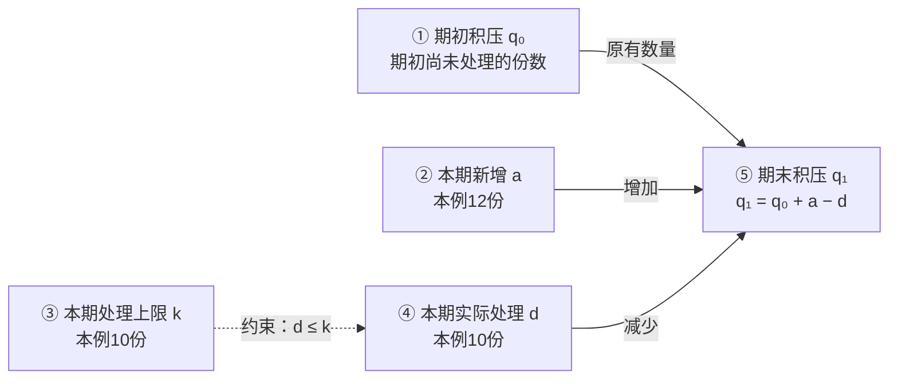
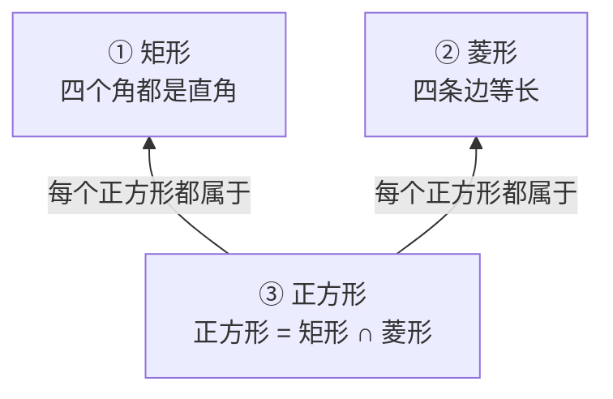

# 表达样例：同一副洞察视角，不同的知识形状

以下两个虚构教学片段示范如何让结构随关系变化。示例只校准表达尺度，不提供需要套用的布局、题材或节点清单。

## 例一：申请积压是一组存量与流量关系

**输入材料**：某窗口这一小时收到 12 份申请，实际处理了 10 份；按当前流程，每小时最多能处理 10 份。已有积压与本小时新增要分开看。若新增持续超过处理能力，积压就会增加。提高处理能力可能有帮助，但还要检查实际处理量及质量。

**看出的结构**：新增和处理改变积压，处理能力约束实际处理量。图围绕数量关系展开，实例直接标在对应变量旁边。

同一时段、同一类申请，数量都以「份」计。本例忽略撤回、转交等其他进出；实际存在时，要补进账目。

### ① 期初积压：时段开始时已经等着的申请

\[
q_0:=\text{期初已进入但尚未处理的申请份数}
\]

这是存量。材料没有给出具体数字，就保留未知；不能把每小时新来的 12 份当作已有积压。

### ② 本期新增：这一时段新进入的申请

\[
a:=\text{本时段进入的申请份数}=12
\]

它使待处理总量增加。12 是这一小时的记录，不说明以后每小时都固定为 12。

### ③ 本期处理上限：当前条件下最多能处理的数量

\[
k:=\text{本时段在当前流程下最多能处理的份数}=10
\]

它给实际处理量设置上限：\(d\leq k\)。上限为 10 不保证实际一定处理了 10；能力与产出是两个概念。

### ④ 本期实际处理：这一时段确实完成的申请

\[
d:=\text{本时段实际完成处理的份数}=10
\]

这是记录中的实际产出。提高 \(k\) 后是否真的提高 \(d\)，需要新的记录，不能靠更高的能力目标代替观察。

### ⑤ 期末积压：原有数量加上净增减

\[
q_1:=\text{期末尚未处理的份数}=q_0+a-d
\]

代入本例：\(q_1=q_0+2\)。当前积压具体多少仍未知，但这一小时增加 2 份可由记录算出。

这条式子还给出判别依据：在上述统计边界内，\(q_1>q_0\iff a>d\)。同样叫「积压严重」，可能是已有数量大，也可能是仍在持续净流入；观察量不同，后续判断也不同。

若要检查调整是否有效，可以另看「积压按约定减少且质量达标」。具体阈值与检查时段原文未给出，这项补充检验不必变成主图的统一终点。

## 例二：矩形与菱形是一组交叉分类关系

**输入材料**：矩形要求四个角都是直角，菱形要求四条边等长；正方形同时满足这两组条件。因此一个图形可以同时是矩形和菱形，两个名称并不排斥。

**看出的结构**：两个判据相交，交集形成正方形。这里适合画集合关系，无须添加「应用—验证—反馈」流程。

本例讨论通常的非退化简单平面四边形。箭头标的是包含关系，不是生成顺序或因果。

| 节点 | 定义与公式 | 具体语义 |
|---|---|---|
| ① 矩形 | `矩形 := {四边形：四个角都是直角}` | 一张相邻边长为 2、3 的长方形纸片满足此条件；判别看角，而不看图形是否横着摆。纸片是补充设例。 |
| ② 菱形 | `菱形 := {四边形：四条边等长}` | 相邻角为 60°、120° 的菱形属于这一类，却不是矩形；该图形是补充的边界例子。 |
| ③ 正方形 | `正方形 := 矩形 ∩ 菱形` | 交集要求两组条件同时满足。正方形能同时归入两个类别，分类无需互斥。 |

把某个对象判为正方形后，可以沿两条包含关系推出它属于矩形、也属于菱形；仅知道它是矩形，不能反向推出正方形。具体对象与判别依据都在图中起作用，但不必被单独排成三个层次。

## 表达尺度

- `效率 = 能力 × 努力 × 流程` 若没有量的定义、单位或依据，只增加了公式外观。
- 每篇文章都画「经验 → 抽象 → 概念 → 学会」，会用分析框架遮住材料自身的知识。
- 只把「具象层／概念层／应用层」换成同义标题，仍然没有解除固定布局。真正改变的是图由什么关系组织。

合格的地图让原文自己的对象站在图里，连线表达它们实际具有的关系，定义和例子让这些关系可以理解与检验。
